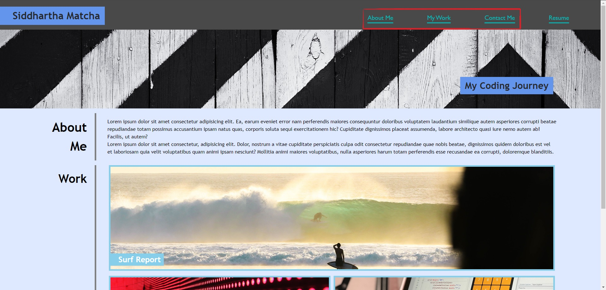

# <My-Portfolio-Page>

## Description

The purpose of creating this website was to build a platform to showcase my future web development work. Unfortunately I have no work to speak of as yet, so the 4 images are merely placeholders for now. Hopefully prospective employers will be able to use this to guage my ability. In terms of my own learning, the project was very useful in cementing my understanding of CSS grids and media queries. Unfortunately the work is incomplete in the latter regard as my coding of the 4 work sections seems less than optimum. I'm hoping that as I come across more websites I can learn more appropriate designs (without using third party assistance like with Bootstrap).

## Usage
The only functionality on the site currently are the links on the navigation bar, that direct the user to their respective positions on the same page:

There is also an external link to my GitHub at the bottom of the page in the Contact Me section.

## Credits
Credit goes to the Skills Bootcamp that taught me how to use CSS well enough to create the website. In addition, Zen Garden was a useful playground to learn how to change CSS elements to suit my needs. Finally, my Module 1 Challenge where I refactored code for the company Horiseon was also a good foundation. I went back and read through the CSS notes to understand the layout of the page, particularly the navigation bar.

## License

I've used an MIT license

---